InsideSound is an application to create albums with songs to listen to. The frontend is in react and in the backend an ecosystem of microservices with springCloud. This project is under construction

View albums list Desktop
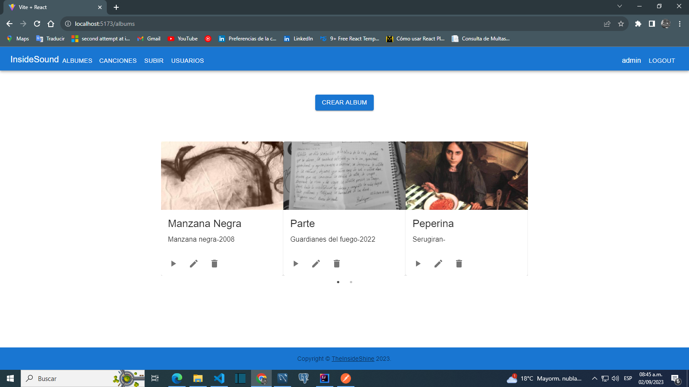

View album crud Desktop
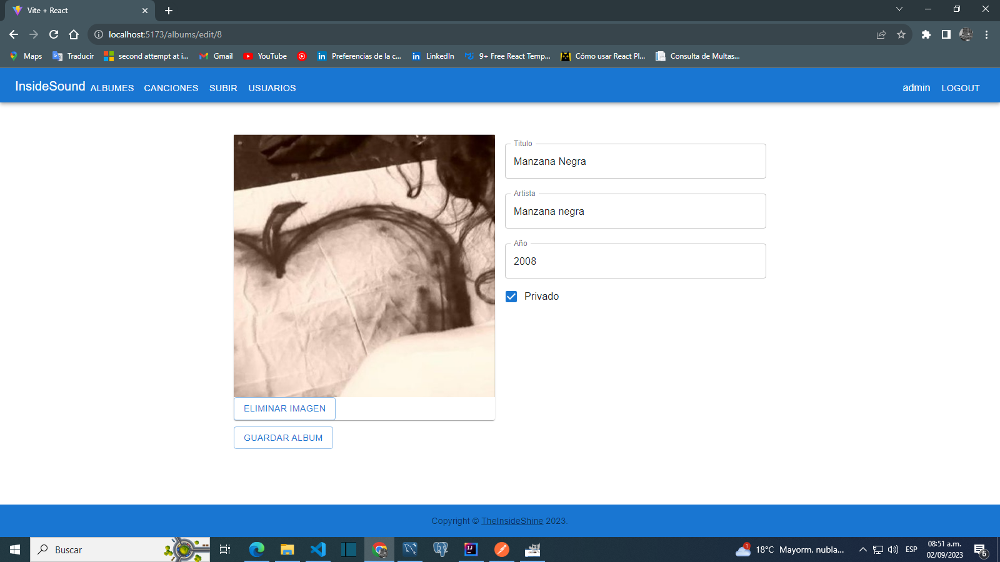

View tracks list Desktop
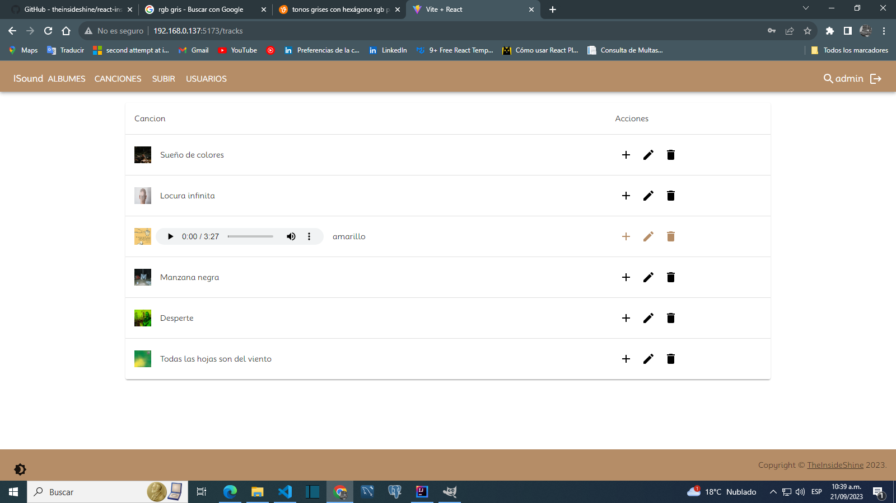

add track to album Desktop
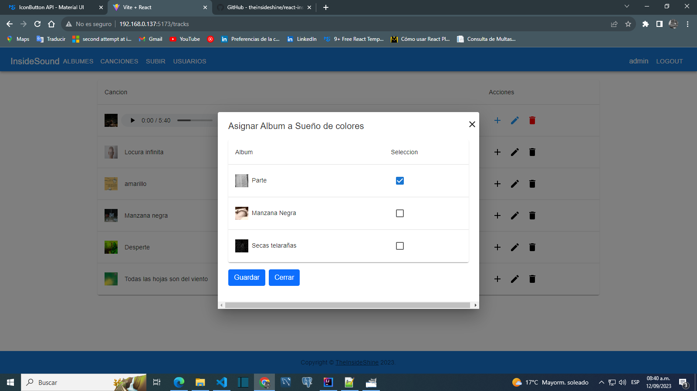

View audioPlayerIs Desktop
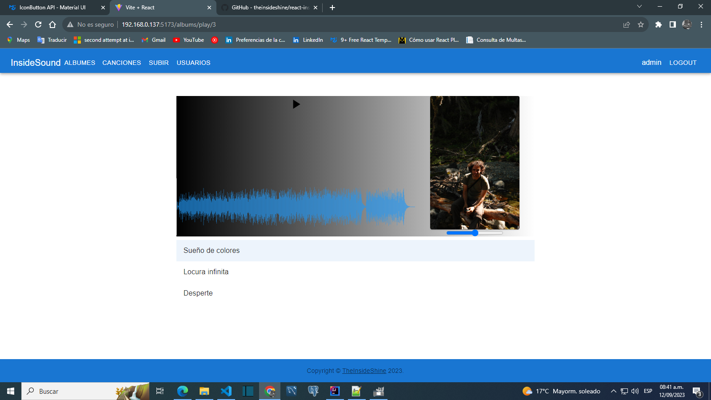

View trackEdit Desktop
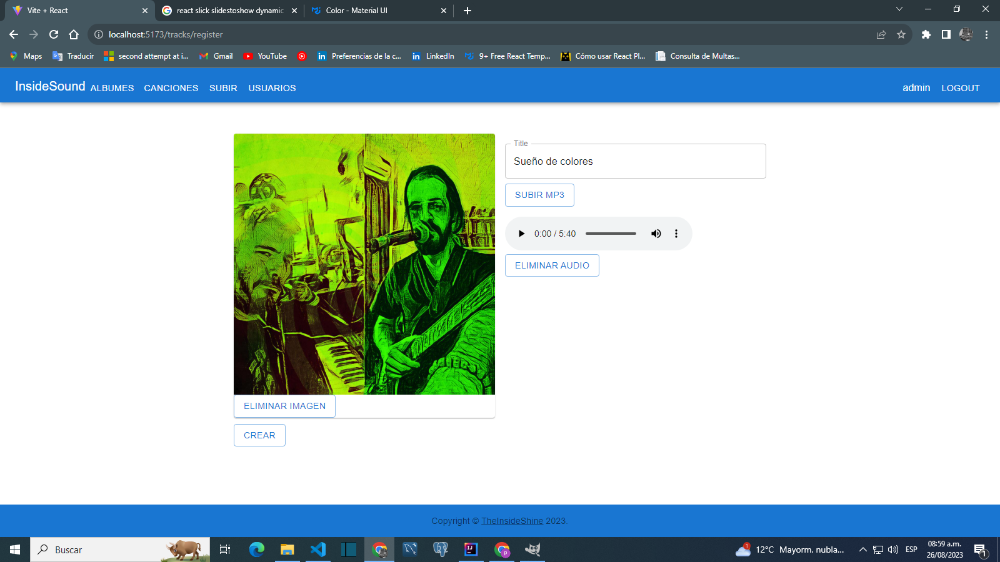

View errors trackEdit Desktop
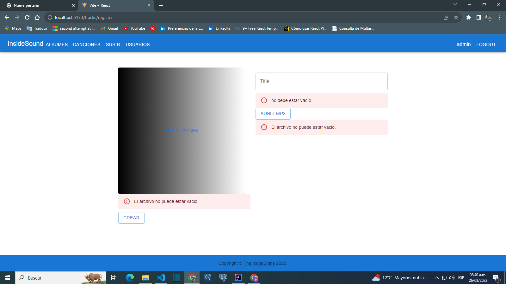

View users list Desktop
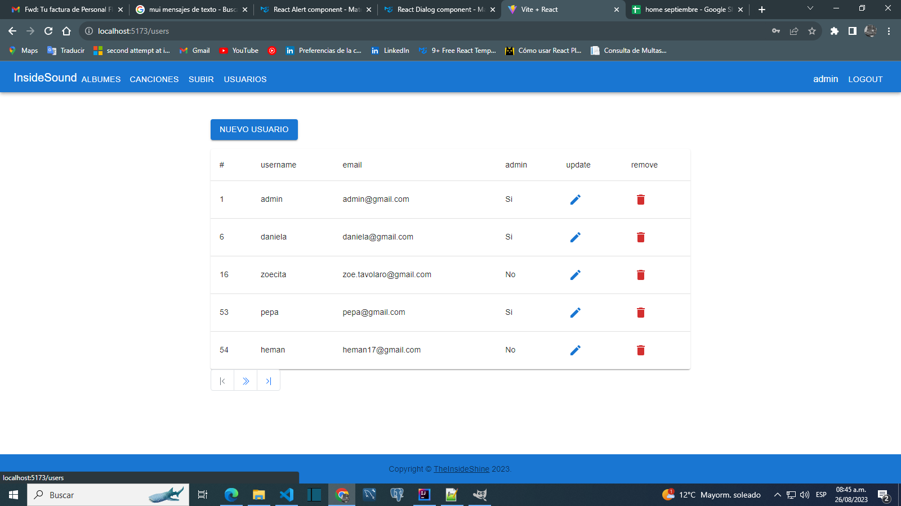

View users crud Desktop
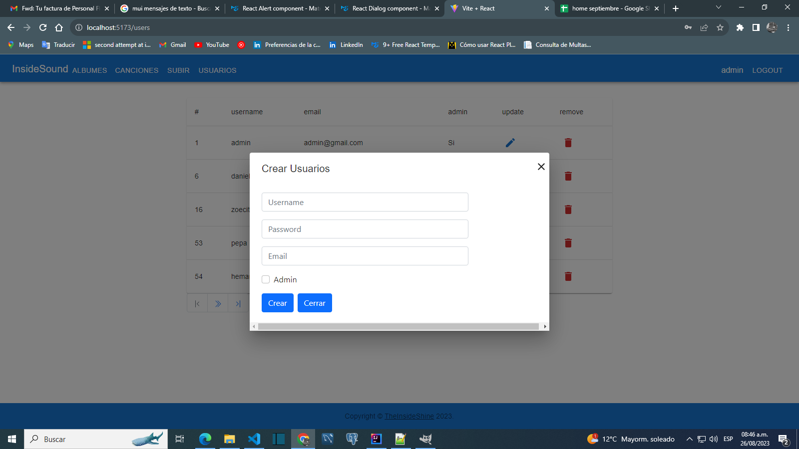

View albums list Mobile

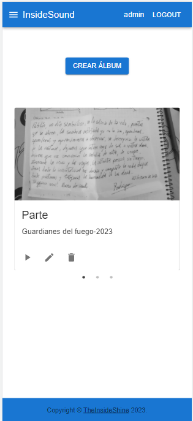

View NavBar Mobile

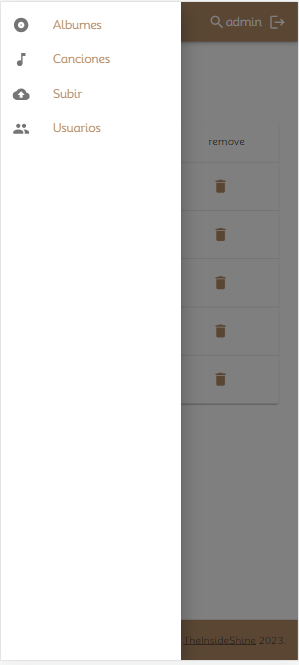

View album crud Mobile

View tracks list Mobile

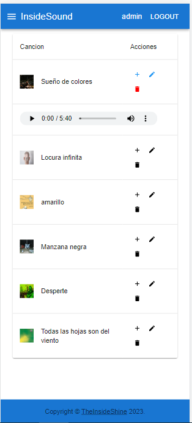

add track to album Mobile

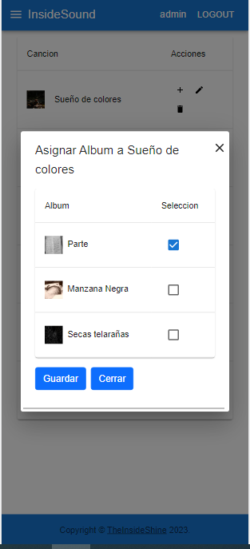

View audioPlayerIs Mobile

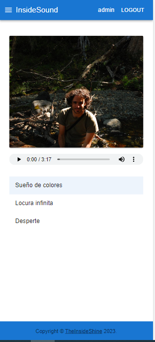

View trackEdit Mobile

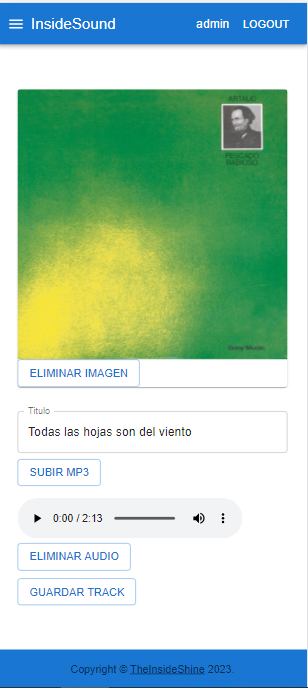

View errors trackEdit Mobile

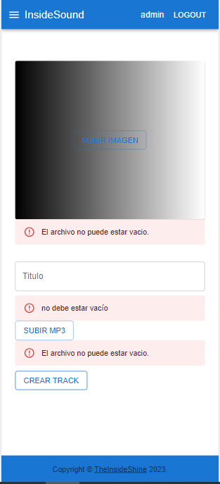

View users list Mobile

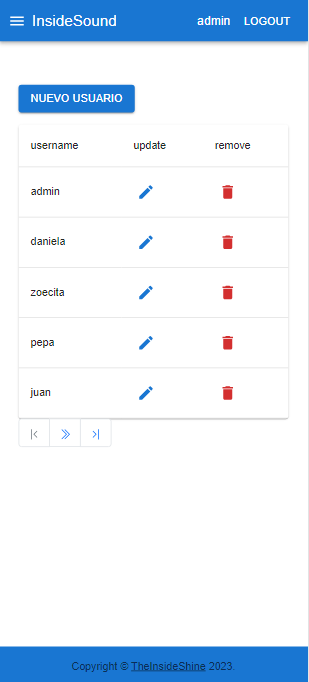

View users crud Mobile

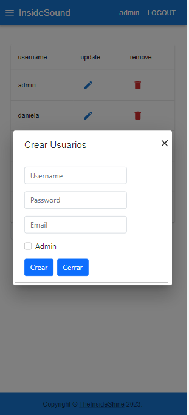

Backend repository: https://github.com/theinsideshine/springcloud-insidesound