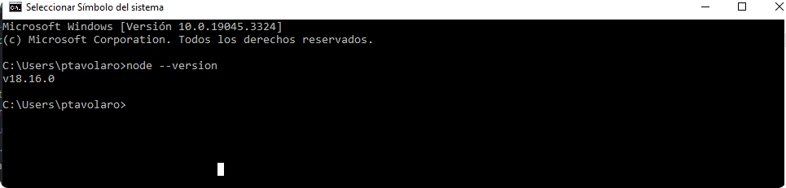

instalar node.js

desde https://nodejs.org/es bajar e instalar la ultima versione estable

para comprobar la instalacion desde un consola de comando tirar el comando 

node --version 

desde esta url: https://github.com/theinsideshine/react-insideSound/tree/without-backend

bajarse el . zip, chequer que el branck sea without-backend

descomprimir el downloadn ir a la carpeta nueva y abrir un consola
correr npm install 

en este punto se instalar todas las dependecias de node 
 

correr npm run dev 

se levanto un servidor con la pagina en el puerto: localhost:517x
 

desde el explorardor se puede acceder con localhost:517x 

por defecto es localhost:5173
 

por el momento solo se puede ver los mismos tracks para los dos albumes 

