This project is under construction

InsideSound is an application to create albums with songs to listen to.

The project is divided into the following parts:

1. Evaluation of the graphical interface and React architecture evaluation -branch master
(https://github.com/theinsideshine/react-insideSound)

2. Improved graphical interface -
Using Figma with AI plugins, and GPT-4 with images to adapt the branch master code -branch changeUi

CustomHooks-Redux-Axios
[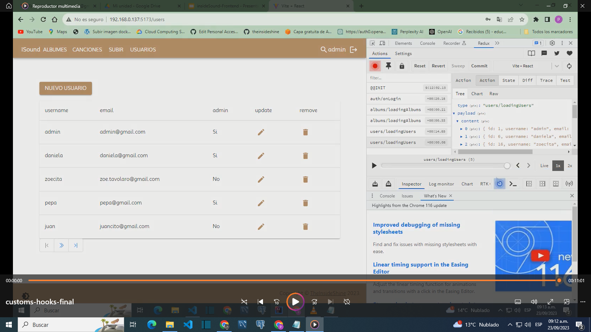](https://www.youtube.com/watch?v=Z2xHULXZpxk)

Home Page 
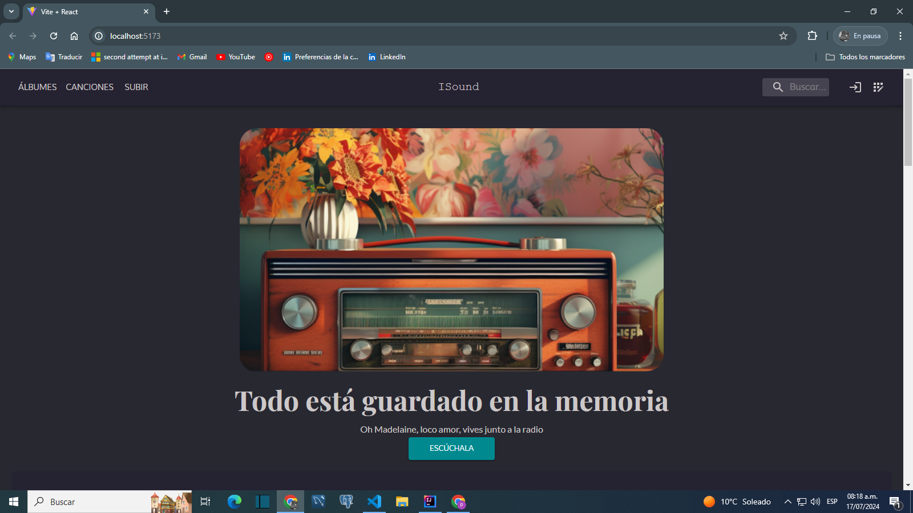

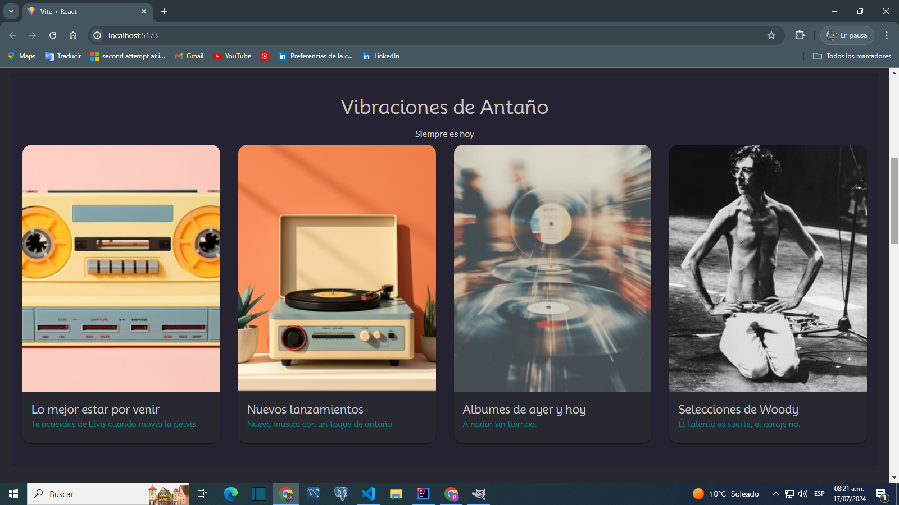

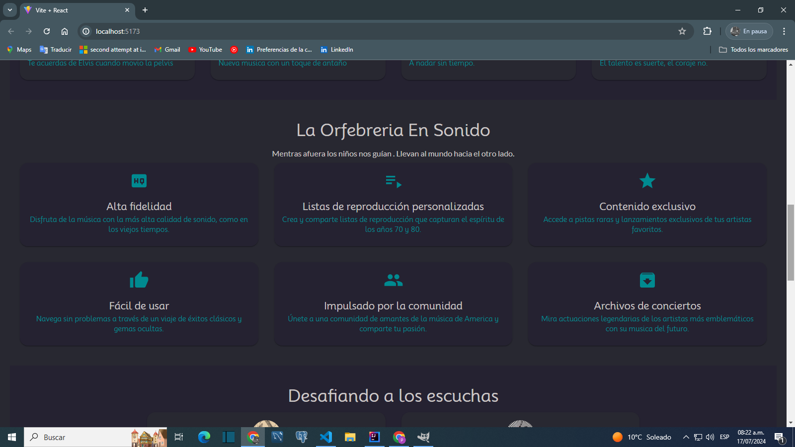

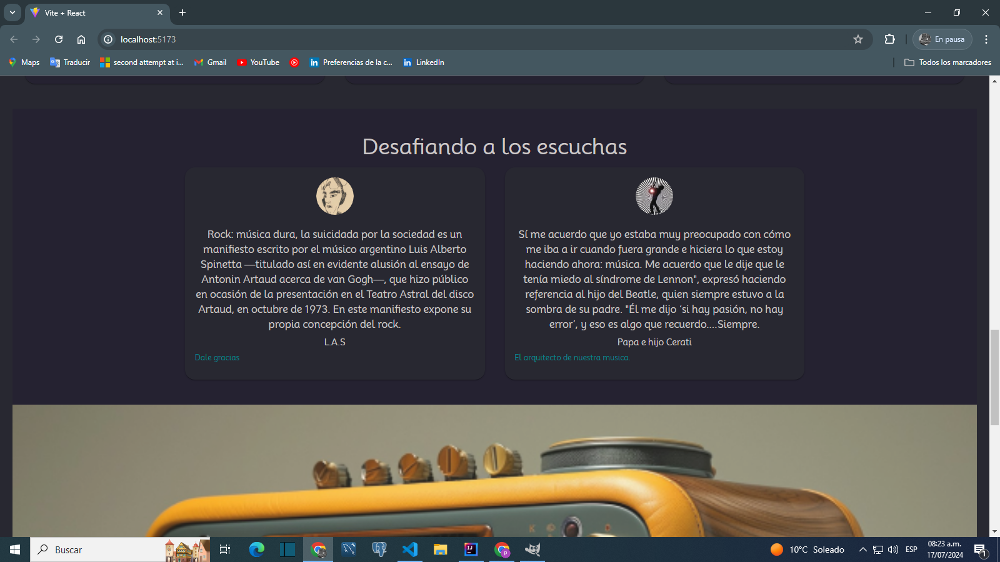

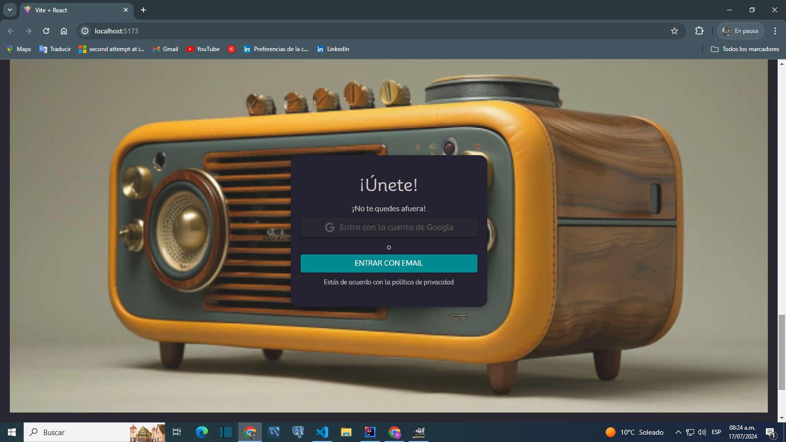

Show public album by username

SignIn
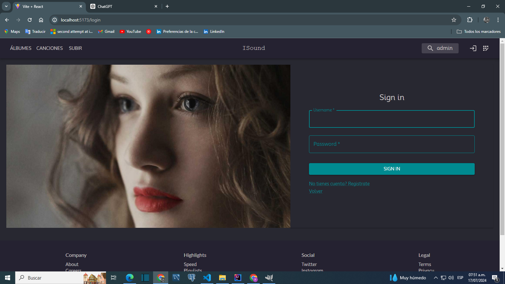

SignUp
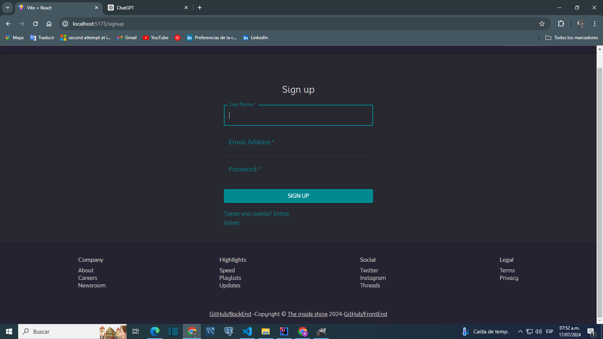

View albums list 

View album edit 
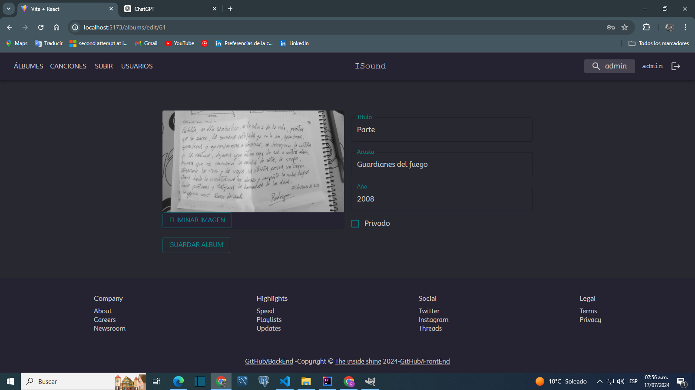

View tracks list 
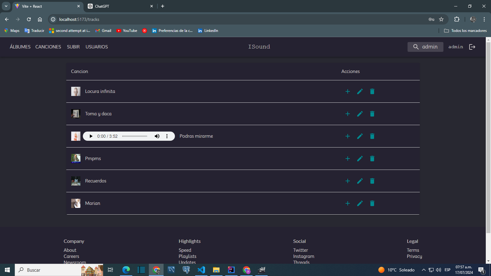

add track to album 
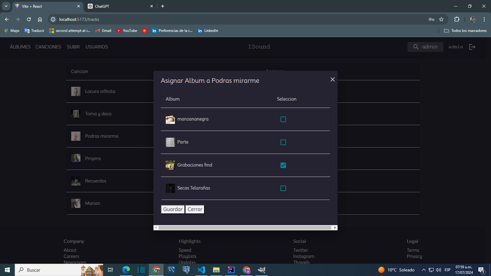

View audioPlayer

View trackEdit
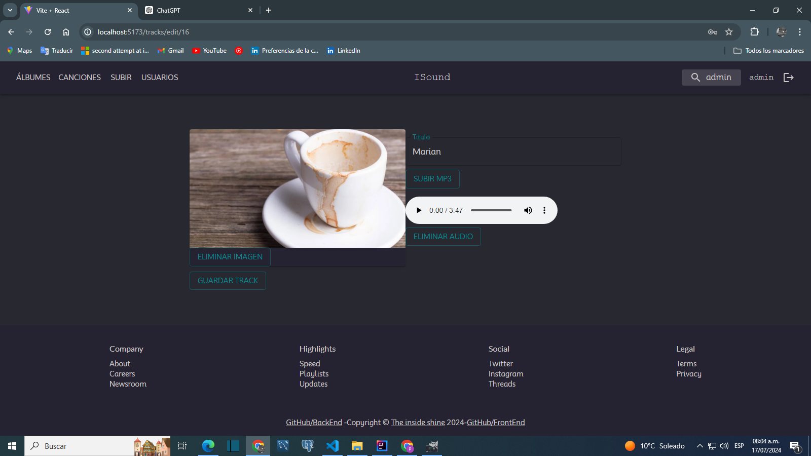

View users list
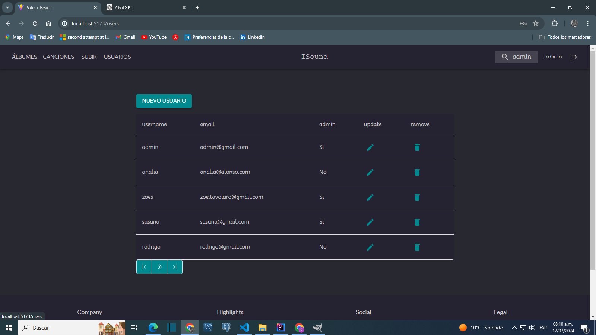

View users edit
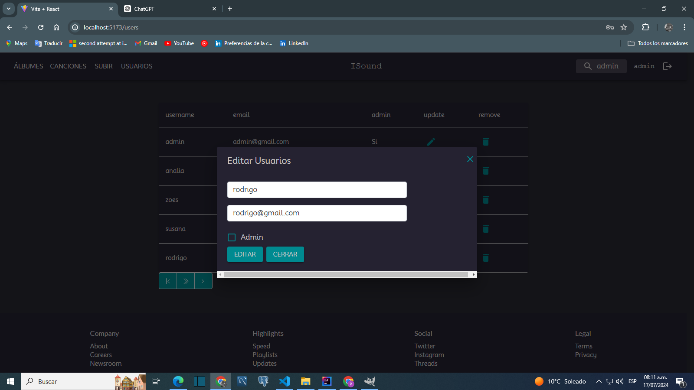

Backend repository: https://github.com/theinsideshine/springcloud-insidesound