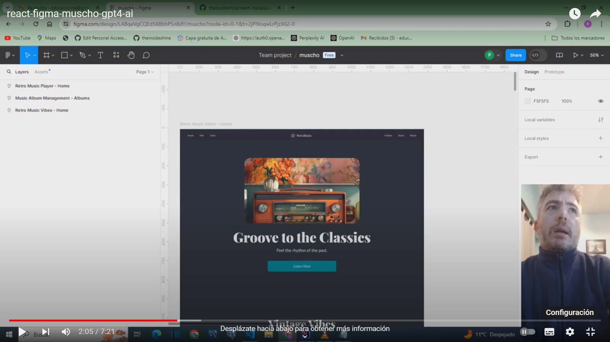
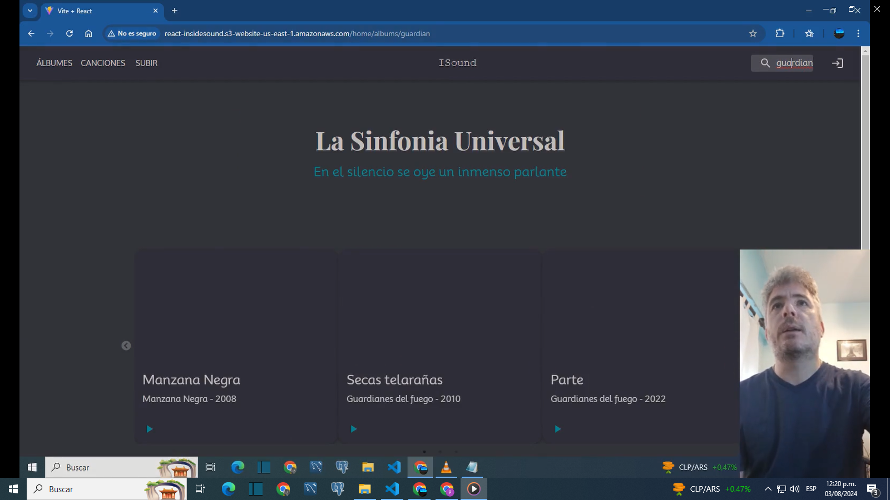
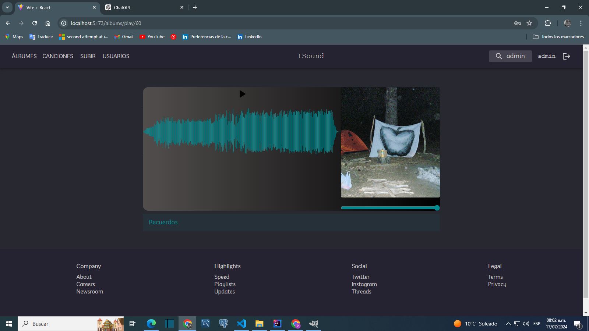

This project is under construction

InsideSound is an application to create albums with songs to listen to.

The project is divided into the following parts:

1. Evaluation of the graphical interface and React architecture evaluation -branch master
(https://github.com/theinsideshine/react-insideSound)

2. Improved graphical interface -
Using Figma with AI plugins, and GPT-4 with images to adapt the branch master code -branch changeUi

Figma-muscho-gpt4-react

Parts of this first stage
FrontEnd:

-CustomHooks-Redux-Axios

-ErrorSystem

-Figma-muscho-gpt4-react

BackEnd:

-Spring Security and Spring Cloud Gateway

-ErrorSystem

-DataModel

-Construction of the containers

-Deploy in minikube

-ISound.Migration of the ecosystems to a monolithic service that meets the design guidelines

-Openapi and junit implementation 

-Message queue-Description characteristics, aspects, communication in microservices architecture

-Investigation to find the stress point of the system. Jmeter-App Custom multithread request(py) The stress point was searched where the Aws-Rds database is loaded. Jmeter and a proprietary app written in python were used

Deploy-demo

TODO:
Frontend

-If I want to edit a track, when recording it deletes the album_id 
 This is because in react this field is not in the redux slice that handles useTrack

-The player should automatically start playing the next track.

-Be able to generate a link to the song

-It is noted that there is a player in the footer in sound cloud

-Resolve the order of songs in the list

Backend

-The tracks table to create from java, when you do the startup of the base 
 the image and mp3 created in tinyLob must be mediumLob.

-When bringing the tracks they end up loading all the tracks into memory and clearing the heap

Home Page 

Show public album by username

SignIn

SignUp

View albums list 

View album edit 

View tracks list 

add track to album 

View audioPlayer

View trackEdit

View users list

View users edit

Backend repository: https://github.com/theinsideshine/springcloud-insidesound