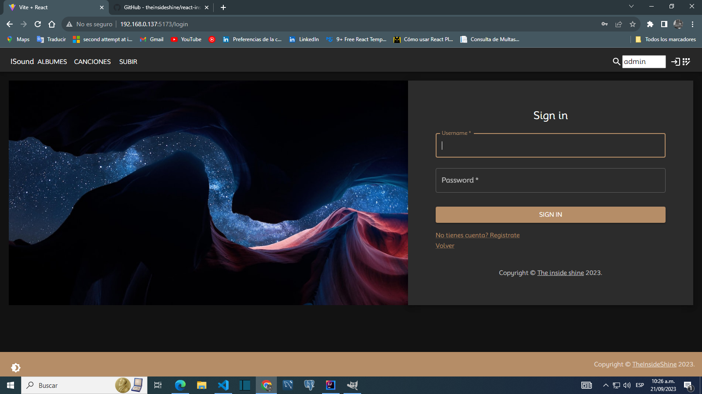
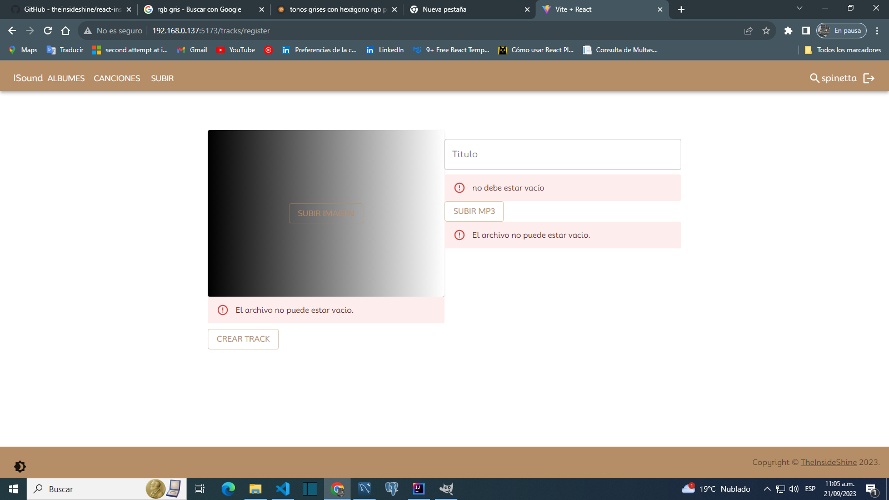
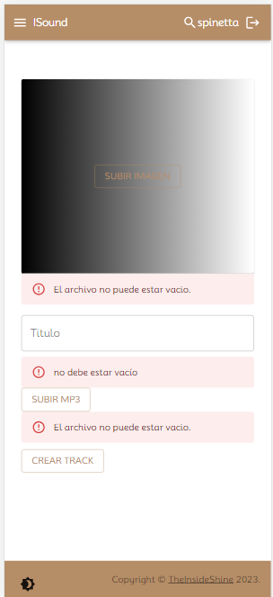
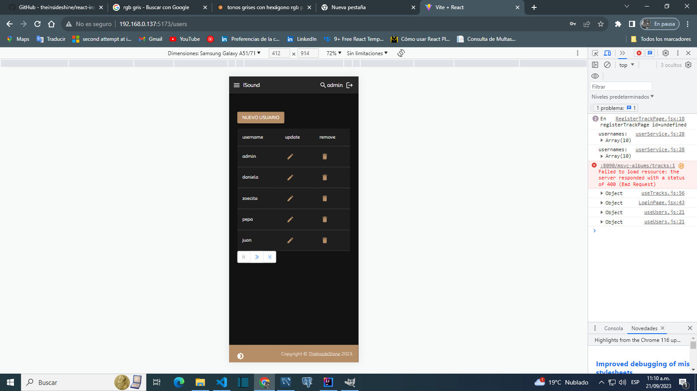

InsideSound is an application to create albums with songs to listen to. The frontend is in react and in the backend an ecosystem of microservices with springCloud. This project is under construction

Home Page 

Show public album by username

SignIn

SignUp

)

View albums list 

View album edit 

View tracks list 

add track to album 

View audioPlayer

 

View trackEdit

View errors trackEdit 

View users list

View users edit

NavbarMobile

Backend repository: https://github.com/theinsideshine/springcloud-insidesound