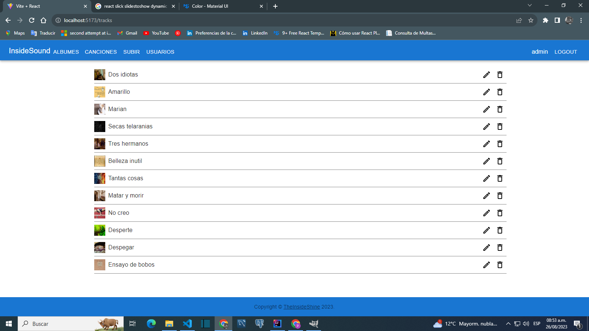

InsideSound is an application to create albums with songs to listen to. The frontend is in react and in the backend an ecosystem of microservices with springCloud. This project is under construction

View albums list

View tracks list

View audioPlayerIs

View trackEdit

View errors trackEdit
![ErrorstrackEdit](images/errrors.png

Backend repository: https://github.com/theinsideshine/springcloud-insidesound